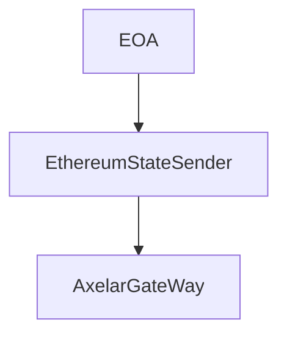
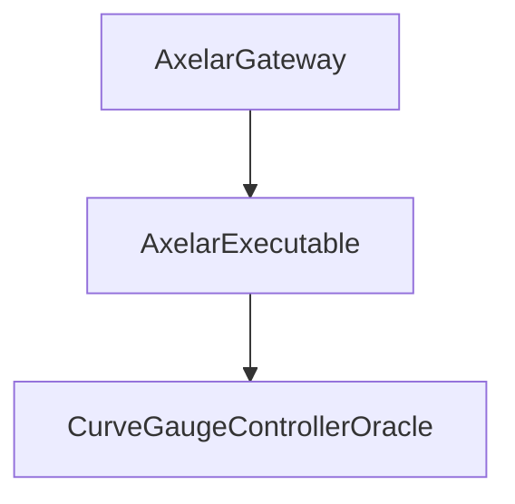

# <h1 align="center"> Votemarket X-Chain Platform </h1>


## Installation

- Require Python

Install Foundry:
```bash
   # This will install Foundryup
   curl -L https://foundry.paradigm.xyz | bash
   # Then Run
   foundryup
```

Install dependencies:

```bash
    forge install
    pip install eth-abi rlp web3
```

Build & Test:
```bash
    forge test
```

# Votemarket X-Chain Platform

Votemarket X-Chain uses encoded RLP Proof to verify accuracy of votes accross sidechains. Each week, a block hash is sent from Mainnet to Sidechains, saving the state of Ethereum Chain on
sidechains. To be able to claim their bounties, users would have to provide Encoded RLP proof of their voting state corresponding to the correct block number / block hash.

## How it works

#### Ethereum side



### Sidechains side



To get Gauges weight and user vote data, `Platform` contract query the CurveGaugeController Oracle.


## Dependency for Generating/Encoding RLP Proofs

### toji CLI Tool

The `toji` CLI tool is a Rust-based utility essential for generating and encoding RLP (Recursive Length Prefix) proofs, especially in the context of the Ethereum Cancun upgrade. This tool facilitates interactions with EVM-based blockchains by providing capabilities to encode and decode RLP data efficiently.

#### Installation

To use `toji` in this project, you must install it globally on your system. Ensure you have Rust and Cargo installed before proceeding. If not, you can install them from [the official Rust website](https://www.rust-lang.org/tools/install).

Run the following command in your terminal to install `toji` from its GitHub repository:

``` bash
cargo install --git https://github.com/rkdud007/toji --locked --force
```


This command installs the latest version of `toji`, making it accessible from anywhere in your system.

#### Usage in Python Scripts

Once installed, you can invoke `toji` from your Python scripts using the `subprocess` module.
