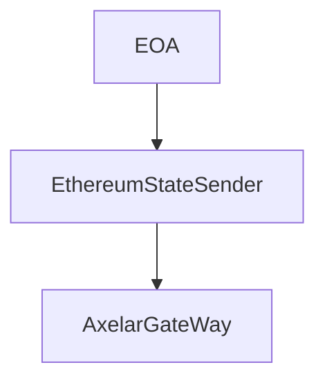
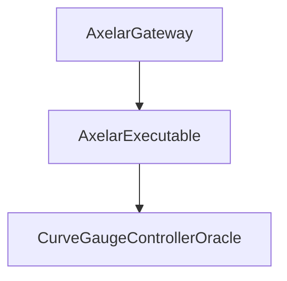

# <h1 align="center"> Votemarket X-Chain Platform </h1>


## Installation

- Require Python

Install Foundry:
```bash
   # This will install Foundryup
   curl -L https://foundry.paradigm.xyz | bash
   # Then Run
   foundryup
```

Install dependencies:

```bash
    forge install
    pip install eth-abi rlp web3
```

Build & Test:
```bash
    forge test
```

# Votemarket X-Chain Platform

Votemarket X-Chain uses encoded RLP Proof to verify accuracy of votes accross sidechains. Each week, a block hash is sent from Mainnet to Sidechains, saving the state of Ethereum Chain on
sidechains. To be able to claim their bribes, users would have to provide Encoded RLP proof of their voting state corresponding to the correct block number / block hash.

## How it works

#### Ethereum side



### Sidechains side

